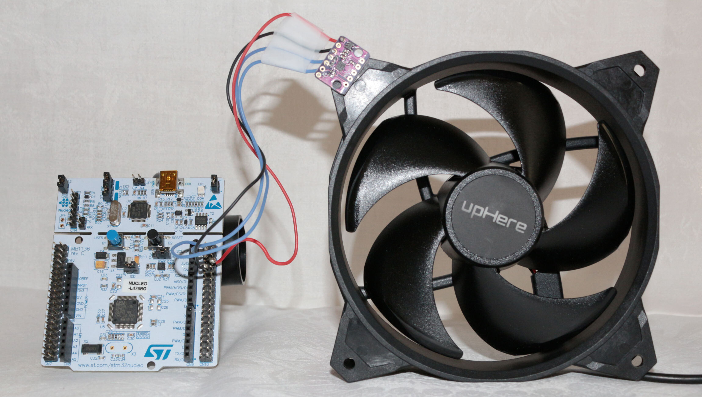

AI小课堂
==========================
.. _pic_major_fan_preview:

.. _pic_major_banner:

Objectives of the tutorial
------------

This project’s goal is to create a device that can be placed directly on a vibrating machine, that will learn its vibration patterns, and detect potential anomalies in its behavior.

This device will integrate and use Cartesiam’s NanoEdge AI Library, which will be selected via NanoEdge AI Studio.

Project constraints
^^^^^^^^^^^

The device will be able to:

register the user’s instructions (learn, detect, reset, etc.)
detect vibrations
learn vibration patterns
alert the user when an anomaly is detected

Requirements
------------

Hardware
^^^^^^^^^^^

The required hardware for this project are:

NUCLEO-F401RE
    STM32 Nucleo-64 development board with STM32F401RE MCU.
    https://www.st.com/en/evaluation-tools/nucleo-f401re.html

    .. _pic_major_NUCLEO-F401RE1:

    .. figure:: ../images/NUCLEO-F401RE1.jpg

BMI160
    A small, low power, low noise 16-bit Inertial Measurement Unit (IMU), combining accelerometer and gyroscope.
    https://www.bosch-sensortec.com/products/motion-sensors/imus/bmi160.html 

    .. _pic_major_bmi160-module2:

    .. figure:: ../images/bmi160-module2.png

USB Fan
    upHere U120 Silent Dual 120mm USB PC Fan, rotation speed: 1600rpm ± 10%
    https://www.amazon.com/upHere-Computer-Cabinet-Playstation-Cooling/dp/B081SYFZZN

    .. _pic_major_fan11:

    .. figure:: ../images/fan11.png

Post-it
    A small piece of paper can go a long way! Use it to block your fan.
    https://www.amazon.fr/Post-Notes-Super-Sticky-47/dp/B00ST46FEY/

    .. _pic_major_postit1:

    .. figure:: ../images/postit1.jpg

Software
^^^^^^^^^^^

The required software for this project are:

ARM Mbed OS 5

    Offline development with the command-line tool ARM Mbed CLI
    https://os.mbed.com/docs/mbed-os/v5.15/quick-start/offline-with-mbed-cli.html
    Version used in the tutorial: 1.10.2

The GNU-RM Embedded Toolchain

    https://developer.arm.com/tools-and-software/open-source-software/developer-tools/gnu-toolchain/gnu-rm/downloads
    Version used in the tutorial: 9-2019-q4-major

Git

    Git is a free and open source distributed version control system.
    https://git-scm.com/

Pygame

    Pygame is a set of Python modules designed for writing video games and multimedia programs.
    https://www.pygame.org/wiki/GettingStarted

NanoEdge AI Studio

    Download NanoEdge AI Studio for free by filling out the following form:
    https://share.hsforms.com/1vVgNZ5JfQAWeJs10Yw6oHQ2a3c9

